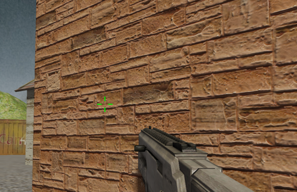
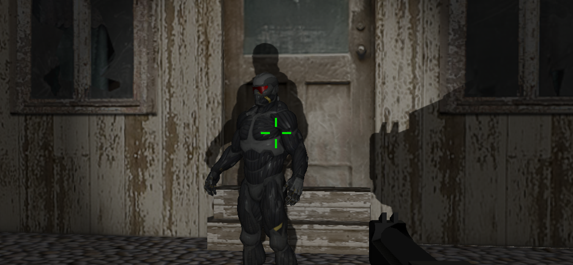
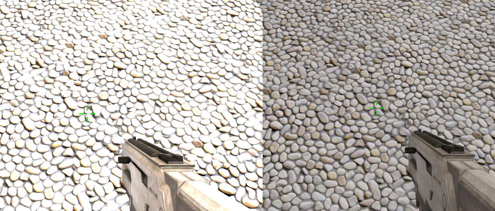

# CG-FPSGame

ZJU CG 2021

不完全文档：`doc`  
可执行文件：`bin/fps.exe`

## 简介

此项目实现了一个简单的FPS游戏。

绘制方面，使用Blinn-Phong光照模型，支持使用法线贴图提升细节，使用Shadow Mapping和PCF生成软阴影，支持HDR，支持Bloom，支持SSAO。

法线贴图：  


阴影：  


HDR：  


Bloom：  


SSAO：  


粒子系统：  


游戏方面，实现了射击检测，碰撞检测，生命值系统，多种枪械切换，枪械后坐力，枪械伤害衰减，简单的敌人攻击等内容。

另外使用开源库[Dear ImGui](https://github.com/ocornut/imgui)制作了场景编辑器，可以自由编辑场景里的游戏对象和光源。使用XML文件保存场景数据，使用到了开源库[TinyXML2](https://github.com/leethomason/tinyxml2)。

## 项目要求

### 基本要求

- [x] 基于 OpenGL/WebGL，具有基本体素（立方体、球、圆柱、圆锥、多面棱柱、多面棱台）的建模表达能力
- [x] 具有基本三维网格导入导出功能（建议 OBJ 格式）
    ObjLoader.cpp

    ```cpp
    // 导入
    Model* ObjLoader::LoadModel(const string& path);
    // 导出
    bool ObjLoader::WriteModel(const Model& model);
    ```

- [x] 具有基本材质、纹理的显示和编辑能力
    Material.h

    ```cpp
    struct Material {
        glm::vec3 colorAmbient;
        glm::vec3 colorDiffuse;
        glm::vec3 colorSpecular;
        float shininess;
        int illum;
        Texture* texDiffuse;
        Texture* texSpecular;
        Texture* texNormal;
    };
    ```

- [x] 具有基本几何变换功能（旋转、平移、缩放等）
    Transfrom.cpp
- [x] 基本光照明模型要求，并实现基本的光源编辑（如调整光源的位置，光强等参数）
    Light.cpp
    支持点光源、方向光、聚光灯，支持距离衰减。
    在`Gui.cpp`中实现了在游戏中编辑光源参数的UI。
- [x] 能对建模后场景进行漫游如 Zoom In/Out， Pan, Orbit, Zoom To Fit等观察功能

### 额外要求

- [x] 漫游时可实时碰撞检测
    场景中部分物体没有设置碰撞箱。
- [x] 光照明模型细化
    实现了法线贴图，实时阴影，SSAO

## 操作说明

`WASD` 人物移动
`1/2` 切换武器
`鼠标左键` 射击
`PageUp/PageDown` 提升/降低画面亮度
`Up/Down` 提升/降低主角的移动速度
`ALT` 切换鼠标模式
`O` 开启/关闭SSAO
`N` 开启/关闭法线贴图
`B` 开启/关闭Bloom
`H` 开启/关闭HDR

## 注意

`lib/glfw3.lib` 是64位的库，所以不能编译32位版本。

源代码采用UTF-8编码，MSVC在中文系统下需要添加编译参数`/utf-8`，否则会出现大量Warning甚至编译失败。

## 如何编译

使用CMake或者支持CMake工程的IDE（例如Visual Studio 2019及以上，CLion等）打开这个文件夹，然后编译。只能编译64位版本，因为`lib`中只提供了64位版本的库。

如果使用Visual Studio Code的CMake插件，最终可执行文件会被输出到`bin/Release/fps.exe`。但是在程序中我们采用相对路径来读取Shader和资源文件，所以会找不到，需要手动将`fps.exe`移动到`bin/fps.exe`才可以正常运行。  
如果使用VS或者CLion则会直接把可执行文件移动到`bin/fps.exe`。

**建议编译Release版本**，在Debug模式下`ifstream`的速度太慢了，读取模型文件要花相当长的时间。

## 参考资料

[[1] https://learnopengl-cn.github.io/](https://learnopengl-cn.github.io/)

[[2] https://wiki.jikexueyuan.com/project/modern-opengl-tutorial/tutorial28.html](https://wiki.jikexueyuan.com/project/modern-opengl-tutorial/tutorial28.html)

[[3] https://blog.csdn.net/qq_31615919/article/details/78968434](https://blog.csdn.net/qq_31615919/article/details/78968434)

[4] OpenGL ES应用开发实践指南  Android卷 [（美）KevinBrothaler著][机械工业出版社]

使用的开源代码：

[UI库：Dear ImGui](https://github.com/ocornut/imgui)

[XML读写：TinyXML2](https://github.com/leethomason/tinyxml2)
